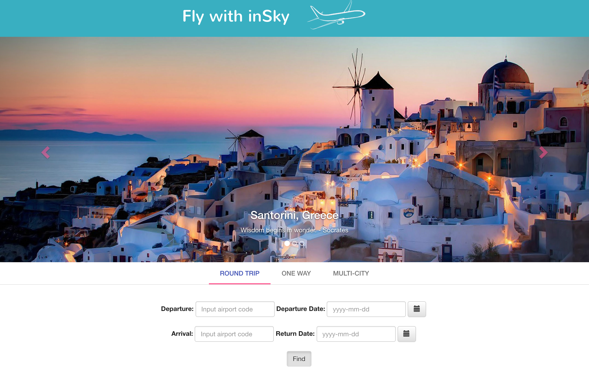
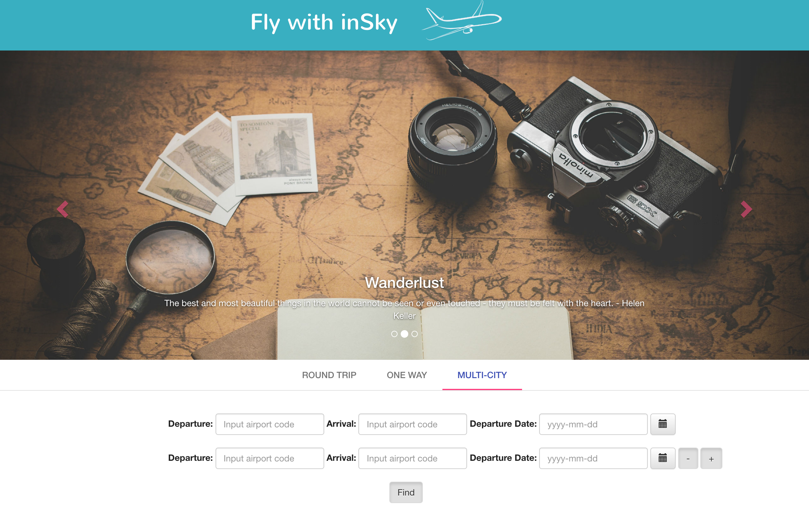

# inSky

inSky is a user-driven web app that provides the ability for users to find the best flight deals for their travels. inSky is dynamic, intuitive, and user friendly. 
 
Simply enter the desired travel dates, the city (or cities) to be visited and inSky will do the rest. Once inSky has the information needed from the API, a trip itinerary and detailed information about pricing are provided. If a user finds a particularly great deal, they can continue onto the airline’s website for easy booking. 

### Tech

inSky uses a number of open source projects to work properly:

* QPX Express API from Google
* Python
* JavaScript
* AngularJs
* Flask
* Jinja
* HTML5
* CSS
* Bootstrap

### Future Feature Implementation

 - Write More Tests
 - Add More Code Comments
 - Refactor the code 
 - Add New feature (User can find things to do at a location.)
 - Add a map that shows the route of the trip.

License
----

MIT
